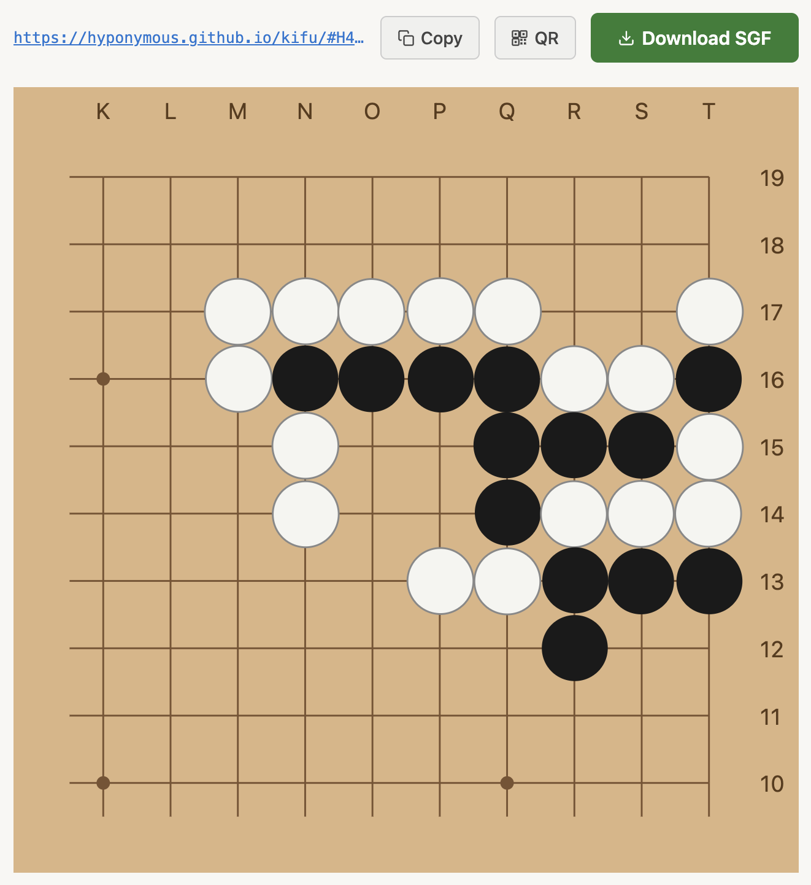
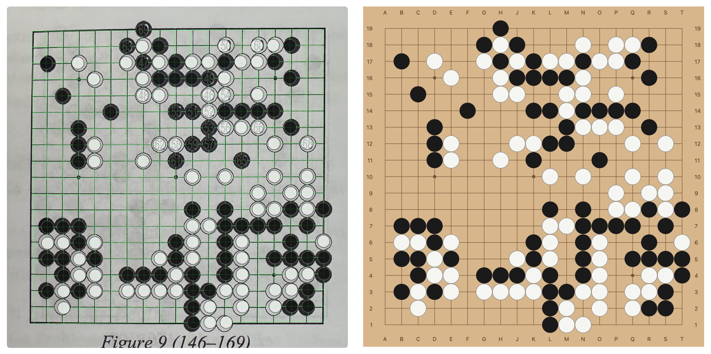

# kifu

**[hyponymous.github.io/kifu](https://hyponymous.github.io/kifu/)**

Share Go game records and board positions via URL — no server, no storage.

SGF data is compressed and encoded directly into the URL fragment (`#...`), which is never sent to the server. Anyone with the link can view and download the file.



## Features

**Share SGF files** — paste SGF text or drop a `.sgf` file on the page to get a shareable link and QR code. Open the link to view the board and download the file.

**Extract positions from photos** — upload or paste an image of a Go diagram (from a book, screenshot, or app) and kifu will detect the board, identify the stones, and load the position into an editor where you can fix any errors before sharing.



## How it works

### URL encoding

The SGF text is gzip-compressed (using the browser's built-in `CompressionStream` API) and base64url-encoded into the URL fragment. Decompression and rendering happen entirely client-side. No dependencies, no server round-trips.

### Photo pipeline

The photo-to-board pipeline uses [OpenCV.js](https://docs.opencv.org/4.x/d5/d10/tutorial_js_root.html) (loaded on demand) to:

1. Detect the board boundary and correct for perspective distortion
2. Find grid lines and stone positions using Harris corners, Hough circles, and Hough lines
3. Dewarp page curl and barrel distortion using thin plate splines
4. Classify each intersection as black, white, or empty using radial gradient coherence

See [ARCHITECTURE.md](ARCHITECTURE.md) for details.

## Limitations

- **URL length:** long game records with many variations or comments may exceed browser URL length limits (~2 KB compressed is safe; very long games may not work). Single board positions should be fine.
- **Photo import is best-effort:** the pipeline works well on clean printed diagrams (books, apps, screenshots) but may struggle with photos of real wooden boards, poor lighting, heavy shadows, or unusual diagram styles. You can fix errors in the editor before sharing.
- **Not a full SGF editor:** kifu is intended for recording and sharing game records. If you want to review games or solve tsumego, there are plenty of other projects and services out there.

## Contributing

Contributions are welcome. Code, bug reports, feature requests, and test images all help.

**Bug reports:** [open an issue](https://github.com/hyponymous/kifu/issues) with a description of what went wrong.

**Images that don't work:** if the photo pipeline fails on an image, please open an issue and attach the image (or email it if you'd prefer not to post it publicly). Failing images are especially valuable since each one becomes a test fixture that makes the pipeline better.

**Code:** fork the repo, make your changes, and open a pull request. Run `npm test` before submitting.

```bash
npm install
npm run dev       # start Vite dev server
npm test          # run all tests
npm run test:e2e  # run pipeline end-to-end tests against fixture images
```

## See also

- [img2sgf](https://github.com/hanysz/img2sgf) — Python tool for converting Go diagram images to SGF
- [Imago](https://github.com/tomasmcz/imago) — Go board image recognition in Haskell

## License

MIT © 2026 Mike Plotz Sage
